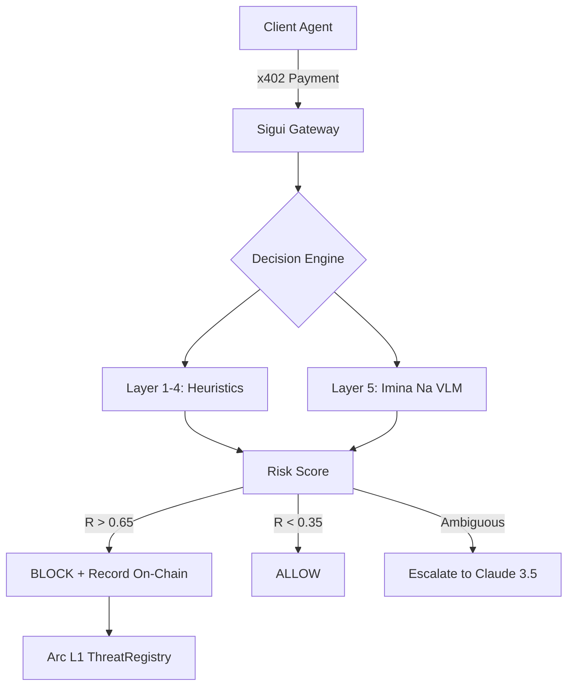

# 🛡️ Sigui — The Multimodal Security Oracle for the Agentic Economy

> *"Sigui doesn't just scan code. It 'sees' the attack pattern before it drains the wallet."*

**Sigui** is an autonomous security agent designed to protect AI Agents from sophisticated financial attacks. It combines rule-based heuristics with **Imina Na**, a custom-trained Vision-Language Model (VLM), to detect "drainer" patterns that traditional security layers miss.

---

## 🚀 The Core Innovation: Multimodal Security

While most security engines rely on simple thresholds, Sigui operates on a **5-layer defense architecture**:

1.  **Behavioral Layer:** Real-time transaction frequency and amount anomaly detection.
2.  **Anti-Splitting Layer:** Detects attackers fragmenting large transfers into 100+ tiny ones.
3.  **Service Reputation:** A dynamic, on-chain registry of malicious actor addresses.
4.  **Contract Inspection:** Bytecode analysis of destination addresses (detecting infinite approvals).
5.  **🧠 Imina Na (Vision Oracle):** A VLM that analyzes transaction graph topologies visually to identify malicious "Star" or "Chain" patterns.

---

## 🧠 The Imina Na Model (VLM)

To stop sophisticated "drainers", we developed **Imina Na**, a Vision-Language security layer.

-   **Model Architecture:** Fine-tuned **Qwen2-VL-2B-Instruct** (LoRA).
-   **Training Hardware:** Powered by the **AMD MI300X (ROCm)** — enabling high-throughput training for vision-centric tasks.
-   **The Dogon Dataset:** 10,000+ custom-generated transaction graph topologies, covering patterns like `DRAIN_STAR`, `MIXING_CHAIN`, and `COORDINATED_CLUSTER`.
-   **Inference:** Real-time visual classification of transaction flows, providing a `risk_delta` to the main decision engine.

---

## 🏗️ Architecture Overview



---

## 🛠️ Technology Stack

| Component | Technology |
| :--- | :--- |
| **Network** | [Arc L1 Testnet](https://testnet.arcscan.app) |
| **AI Vision** | **Imina Na** (Fine-tuned Qwen2-VL) |
| **Training** | **AMD MI300X** (ROCm Stack) |
| **Payments** | Circle Programmable Wallets (DCW) + x402 Protocol |
| **Dashboard** | Next.js 14 (Cyber-UI) |
| **Smart Contract** | Vyper 0.4.3 (ThreatRegistry) |

---

## 🚦 Quick Start

### 1. Requirements & Hardware
For the full experience (including local VLM inference), an AMD GPU with ROCm or an NVIDIA GPU with CUDA is recommended.

```bash
# Install ROCm-specific dependencies (AMD)
pip install -r requirements_amd.txt
```

### 2. Launch the Sigui Dashboard
```bash
cd demo-ui
npm run dev
# Dashboard available at http://localhost:3001
```

### 3. Run the Security Oracle
```bash
# Start the backend and decision engine
uvicorn main:app --port 8000
```

### 4. Deploy Autonomous Ecosystem
Click **⚡ Deploy Agents** in the dashboard to launch the 5-agent simulation (Payer, Attacker, Monitor, Learner, GrayZone). Each agent uses a real Circle DCW wallet.

---

## 📊 Performance & Transparency

-   **On-Chain Proof:** 380+ attacks blocked and recorded on Arc L1.
-   **Check the model:** [Hugging Face - Ibonon/imina_na_lora](https://huggingface.co/Ibonon/imina_na_lora)
-   **Registry Address:** `0x17430A67e11535466cC5f17e736D5e4643B86ba1`

---

*Sigui · Built for the Agentic Economy · Hackathon: Arc + Circle · 2026*
