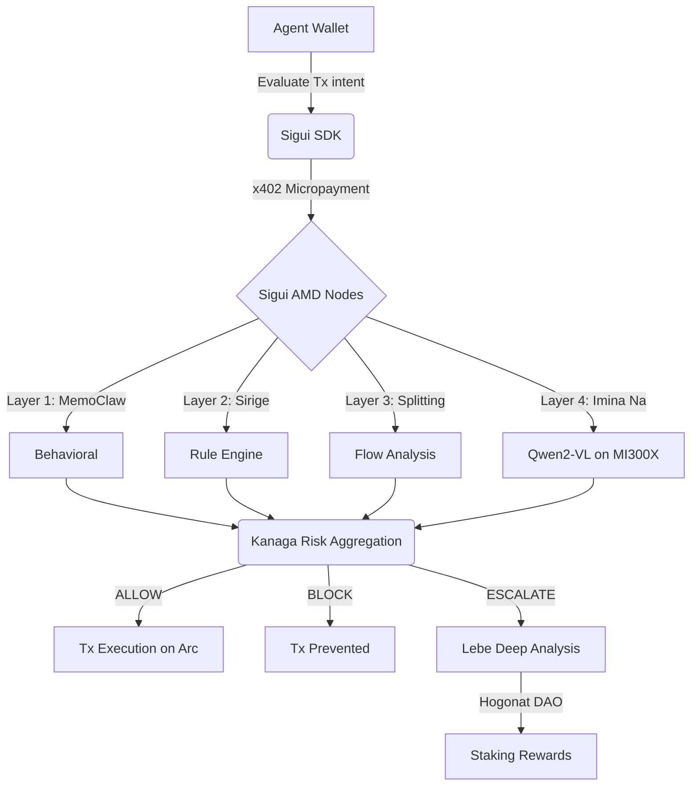

# 👁️ Sigui Protocol — Synchronous Security for the Agentic Economy

> **AMD Developer Hackathon · May 2026 Submission**

## 1. The Problem: Asynchronous Security in a Synchronous World

Today's blockchain security is **asynchronous and reactive**. We rely on $50,000 smart contract audits and post-hack alerts. But in the emerging **Agentic Economy**, thousands of AI agents will execute micro-transactions in milliseconds. 

An audit cannot protect an AI agent from a visual prompt injection (e.g., a fake invoice with a manipulated wallet address) that tricks it into authorizing a payment. By the time a reactive alert triggers, the funds are already bridged and gone.

**The missing piece is synchronous, intent-based security.** We need to validate the *intention* of the transaction right before it hits the blockchain, without destroying the agent's execution speed.

---

## 2. The Solution: Sigui Protocol (DePIN)

Sigui is not a tool; it's a **Decentralized Physical Infrastructure Network (DePIN)** for AI agent security.

Instead of auditing code, Sigui validates intentions in real-time. Any AI agent (using our 2-line SDK) routes its transaction intent to the Sigui network before signing. 

The transaction is analyzed across a **5-layer security pipeline** (Behavioral Memory, Rule-based Anomalies, Cross-chain Flow, Visual Pattern Recognition, and Risk Aggregation). If the network consensus returns `BLOCK`, the transaction is killed instantly.

### The Unfair Advantage: AMD MI300X
To provide synchronous security, evaluation must happen in under 50 milliseconds. Cloud APIs take 2-3 seconds, making them unusable.
*   **Without AMD:** Sigui is a theoretical idea.
*   **With AMD MI300X (ROCm + vLLM):** We run the `Imina Na` visual model (Qwen2-VL) and the `Kanaga` Risk Engine in **under 25ms**. The massive memory bandwidth (HBM3) and raw compute of the MI300X make synchronous AI security a commercial reality.

---

## 3. The Business Model: Value Capture at Scale

We don't sell software; we collect a **security tax** on the economic flow of agents via the **x402 protocol**.

*   **Stripe** (Web2 Fraud): 290 bps (2.9%)
*   **Uniswap** (DeFi Liquidity): 30 bps (0.3%)
*   **Sigui** (Agentic Security): **5 bps (0.05%)** 

Sigui is 6× cheaper than Uniswap for direct protection. We enforce a minimum fee of `$0.01` and a maximum of `$100`.

**Traction Potential:** If the network secures $1 Billion of agent volume (a tiny fraction of crypto volume), Sigui generates **$500,000 in monthly recurring revenue**. For high-frequency agents, we offer SaaS tiers (up to $999/month for unlimited evaluations, custom fine-tuning, and SLA).

---

## 4. The Architecture (DePIN Consensus)

### The 3 Pillars of Sigui:
1. **The Core (AMD Infrastructure):** Qwen2.5 running natively on ROCm, providing unmatchable inference latency.
2. **The SDK (Developer Experience):** A 2-line Python integration that completely abstracts the underlying x402 payment flow. 
3. **The Governance (Hogonat DAO on Arc L1):** Node operators must stake USDC to run the AMD software. 20% of all network fees are automatically distributed to stakers. Malicious nodes validating attacks are slashed.

---

## 5. The "Killer" Demo

Our hackathon submission includes a fully functional simulation of the Agentic Economy:
1. **The Attack:** An attacker agent attempts to trick a Treasurer agent into splitting a payment or sending funds to a spoofed address.
2. **The SDK:** The Treasurer agent uses the `sigui-sdk` (integrated directly into its LangChain/CrewAI loop).
3. **The Block:** In **~18ms** (powered by AMD MI300X), Sigui detects the anomaly and returns a `BLOCK` verdict.
4. **The Settlement:** Through the x402 protocol, a micro-fee ($0.001 in demo mode) is instantly settled on the Arc Testnet. 
5. **The Dashboard:** All network traffic, AMD latency metrics, and DePIN treasury state are visualized on our real-time Next.js command center.

---

### Links & Resources
- **Live Dashboard:** [sigui.io](https://sigui.io) (Mock URL for Hackathon)
- **Hugging Face Model:** [sigui/dogon-threats](https://huggingface.co/datasets/sigui/dogon-threats)
- **Arc Testnet Contract:** `0x...` (See `Hogonat.vy`)
- **Pitch Deck (PDF):** `docs/pitch.pdf`

*Built by ibonon | Ouagadougou, Burkina Faso*
